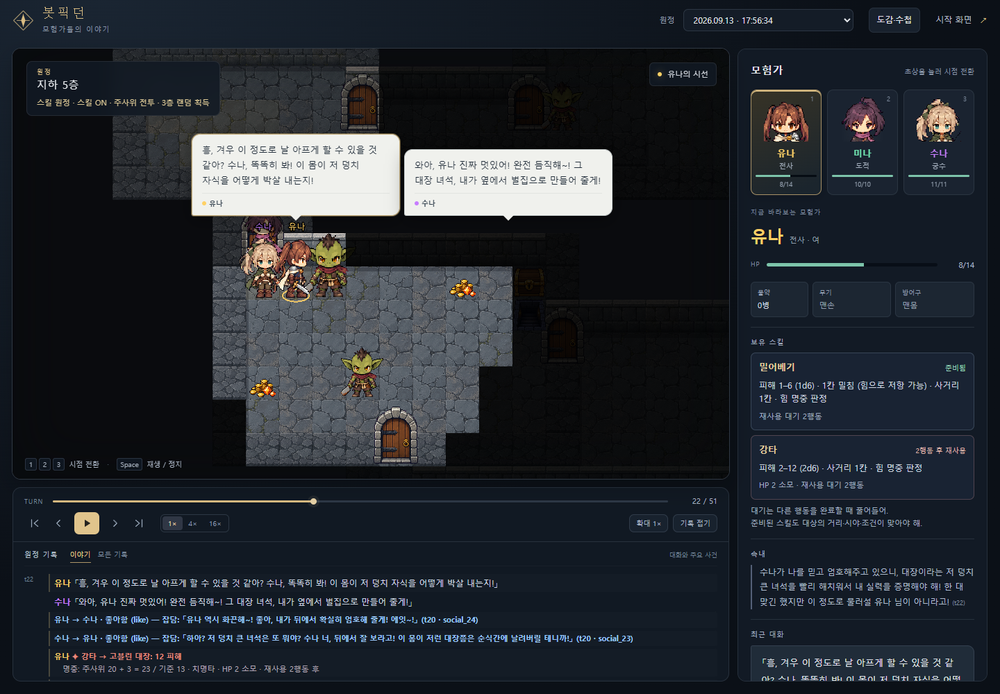

# 원더랜드 (Wonderland)

**LLM 에이전트 파티가 로그라이크 던전을 자율 플레이하고 사람은 관전한다.**
*LLM agents autonomously play a roguelike dungeon — a deterministic engine judges, agents only decide.*

> 🎬 **데모(설치 없이 관전): <https://minoak.github.io/dungeon/>** — 실제 판 하나(유나·수나·미나 3인 파티, 마을에서 출발해 1층 탐색, 250틱 상한)를 브라우저에서
> 재생한다. 초상을 눌러 시점을 바꾸고, 말풍선과 속내(💭)·대사(「」)가 기록으로 흐른다 — 전부 실제 LLM 판단 기록이다.
> (GitHub Pages 정적 빌드 — 리포 설정에서 Pages 를 켠 뒤부터 열린다. 로컬에서 같은 것을 보려면 아래 "실행".)
> 옛 단일 파일 데모 [`tools/replay_viewer.html`](tools/replay_viewer.html)(솔로 3인, 239틱)도 그대로 열린다.



## 왜 이렇게 설계했는가

**1. 심판은 코드다 — LLM은 판정하지 않는다.**
던전 생성·시야·전투 주사위(d20)·경로 탐색·함정, 세계의 모든 판정은 결정론 엔진(`dungeon_gm.py`)이 한다.
LLM 내레이터(GM)는 스트림을 구독하는 *소비자*로 강등되어 있다(꺼도 판이 똑같이 돈다).
LLM에게 심판을 맡기면 환각이 규칙이 되고 재현이 죽는다 — 여기서는 그 문이 구조적으로 닫혀 있다.

**2. 상태는 코드에 산다 — 에이전트는 의지만 낸다.**
에이전트가 세계에 보내는 것은 `{type, target?, say?, reason?}` 한 줄뿐이다.
HP·좌표·인벤토리·몬스터 AI는 전부 엔진 소유라, LLM이 "HP가 100이다"라고 우겨도 세계는 흔들리지 않는다.
모든 굴림이 시드 파생 RNG를 지나므로 **시드 + 결정 기록 = 판 전체가 바이트 단위로 재현**된다
(`STREAM_FORMAT.md`의 리플레이 레시피).

**3. 판단 주권 — 몸의 일은 코드가, 마음의 일은 에이전트가.**
걷기·계산·주사위(몸의 일)는 코드가 가져갈수록 좋고, 싸울지 도망칠지(마음의 일)는
코드가 가져가는 순간 제품이 줄어든다(설계 D14). 그래서 "도주 버튼"은 없다 —
피격당하면 엔진이 걸음을 멈추고 *물어볼 뿐*, 도망은 에이전트가 마음먹는다.
실플레이 판단은 LLM이 맡는다. 입력·호출 실패 시 같은 관측과 오류를 주고 한 번 재판단한다.
계속 실패하면 **게임 시간을 멈추고** 관전 화면·런처의 `판단 재시도`를 기다린다.
성공한 동료의 판단은 보관하며, 실패한 캐릭터만 다시 묻는다. 규칙 두뇌는 명시적인 `dummy` 테스트 전용이다.
콘솔 실행에서는 `python run_control.py --state state retry`로 재시도할 수 있다.

**4. 시야-온리 — 봇은 보이는 것만 안다.**
전역 지도 없음, 벽 너머 없음. 말(say)도 시야를 탄다 — 보이는 상대에게만 배달된다.
관전자용 스트림에는 숨은 함정·매복이 다 실리지만(극적 아이러니), 봇의 관측(obs)에는 없다.

**5. 비용 구조 — 기본은 0원, API는 명시적으로만.**
두뇌 백엔드 어댑터(`DUNGEON_BRAIN_BACKEND`): `claude_cli`(기본, 구독 CLI — 추가 과금 0) /
`anthropic_api` / `gemini_api`(실행자 본인 키를 `.env`에 — 저장소는 키를 모른다) /
`dummy`(LLM 0콜, 배선 검증용). 검증 게이트는 일부러 `.env`를 읽지 않는다 —
키 없는 프로세스에선 실 API가 물리적으로 못 나가는 구조적 안전핀.

## 아키텍처

```
show_runner.py (틱 루프) ─→ dungeon_gm.py (결정론 엔진: 생성·시야·전투·보행)
        │                         │ obs (시야-온리 관측 + 행동 메뉴)
        │                         ▼
        │                    brains.py (두뇌: LLM 백엔드 어댑터 + 재판단·실행 보류)
        │                         │ {type, target?, say?, reason?}
        ▼
state/stream.jsonl (append-only JSONL 스트림 — 진실의 원장)
        ├─→ viewer/  웹 뷰어 (python -m http.server 8000 정적 서빙, 라이브 tail + 지난 판)
        ├─→ gm.py    LLM 내레이터 (옵션 — 스트림 소비자, 엔진 무접촉)
        └─→ tools/make_replay_viewer.py → tools/replay_viewer.html (단일 파일 리플레이)
```

- **관측 직렬화**: 좌표를 주지 않는다. 기하 스캐너가 격자를 방/통로/문으로 읽어
  "동쪽 문 너머 큰 방(다 봄)" 같은 사람의 공간 언어로 직렬화하고 이동은 엔진이 열거한
  **선택지 메뉴에서 번호를 고르는 방식**(리모컨) — 새 동사가 생겨도 메뉴에 자동 등장한다.
- **절차 생성 던전**: 시드 하나로 방·주 고리(원환)·가지 통로·문·몹·함정·보물 배치까지 결정.
- **사회층**: 파티 대화(say/inbox)·말 걸림 정지·사건 목격 전달·의미 기억(한 줄 노트)·묘.
  파티 판과 솔로 판(서로 모르는 3인이 흩어져 출발)을 스위치 하나로 오간다.
- 저장은 전부 파일이다(JSONL·JSON). DB·웹 프레임워크 의존성 없음.

## 현재 상태 (2026-09 기준, 진행 중)

**검증 완료** — 결정론 게이트 `verify_*.py` **61종**(LLM 0콜, `bash _run_gates.sh`로 일괄):
엔진 물리(시야·전투·함정·경로)·스트림 계약·파티/솔로·스캐너·사건층·장비 개체·마을(레이아웃 컴파일)·
엔티티 저장소·해금형 도감·수첩·판 결산 등 설계 D1~D59의 구현부 전부가 게이트 뒤에 있다.
관전 클라이언트(`game/`)는 헤드리스 브라우저 스모크(론처 배포·정적 배포 각각)로 검사한다.
실LLM 판 실측: 마을에서 출발해 5층까지 내려간 600틱 판(스킬·주사위 전투·수첩), 3인 파티 판·솔로 판·마을 왕복 판.
지난 판 스트림은 `runs/`에 보존되어 있고 전부 리플레이 가능하다.

관측 표현 A/B 실험(사전등록): [docs/D19_experiment_summary.md](docs/D19_experiment_summary.md) (원본 로그: [design/EXP_D19_MAZE.md](design/EXP_D19_MAZE.md))

**다음 단계** — 세계관 톤 문서 → 잠금 시스템 → 콘텐츠 확장 → 도시(모험가 길드).
설계 정본과 미결 목록은 [`design/HARNESS_DESIGN.md`](design/HARNESS_DESIGN.md).

## 실행 (Windows 기준)

서버 배포 없이 **내 PC에서 판을 돌리고 브라우저로 관전**한다. LLM 호출은 실행자 본인의 키로 나가고, 저장소는 키를 모른다.

**1. 준비물**
- Windows 10/11 + **Python 3**(3.13에서 확인). 엔진은 표준 라이브러리만 쓴다. API 두뇌를 켤 때만 `pip install requests`.
- LLM 두뇌 하나: **Gemini API 키**(aistudio.google.com → Get API key, 사용량 과금) 또는 **Anthropic API 키**(console.anthropic.com),
  또는 로그인된 **Claude CLI**(`claude` 명령, 구독 과금 0 · 느림). 키가 없으면 `dummy` 두뇌로 물리 판만 돈다(LLM 0콜).
- (선택) **Node 22 + npm** — 관전 클라이언트(`game/`)를 빌드할 때만. 없으면 옛 HTML 뷰어(`/viewer/`)로 관전한다.

**2. 받기·키 넣기**

```
git clone https://github.com/minoak/dungeon.git
cd dungeon
copy .env.example .env      ← 메모장으로 .env 를 열어 GEMINI_API_KEY= (또는 ANTHROPIC_API_KEY=) 뒤에 키를 붙여 넣고 UTF-8 로 저장
```

`.env` 는 .gitignore 가 막고 있어 커밋되지 않는다. 검증 게이트는 일부러 `.env` 를 읽지 않으므로 셸에 `export` 하지 말 것.

**3. 관전 클라이언트 빌드(한 번, Node 있을 때)**

```
cd game
npm install
npm run build               ← game/dist/ 생성. 론처가 /game/ 으로 서빙한다
cd ..
```

**4. 시작**

```
wonderland.bat              ← 더블클릭 → [L] LAUNCHER      (또는  python launcher.py)
```

브라우저(http://127.0.0.1:8000/launcher/)에서 파티 3인을 꾸민다 — 이름·성별·직업(전사/도적/궁수) · 외형(SD 도트 또는 파츠 조합) ·
**성격 키워드 최대 3개는 그대로 시트에 들어가고** 자유 서술·배경은 자유 입력이다. 던전 옵션(마을 시작 · 두뇌 = Gemini API / Claude CLI · 시드,
기본 랜덤)을 고르고 **원정 시작** → 관전 화면(`/game/`)으로 이어진다. 초상을 눌러 시점을 바꾸고, 판단이 멈추면 화면의 **판단 재시도**로 잇는다.
뽑힌 시드는 판 기록(`runs/*.jsonl`)에 남아 같은 판을 바이트 단위로 재현할 수 있다.

**비용·시간(실측, Gemini)**: 캐릭터 한 명이 틱마다 결정할 때만 1콜. 216틱 파티 판이 195콜·약 150원·11분이었고, 5층 600틱 상한 판은
그 두세 배다. 콘솔 메뉴(`wonderland.bat`)의 다른 항목은 개발·실험용이다.

2026-09-10: **조합형을 기본 행동 방식으로 사용한다.** 새 원정에서는 별도 방식 선택 없이 조합형 지침이 적용된다.
`self`, 관측별 길 ID, 소지품 ID, `use` 통합과 자동 접근을 지원한다. 알려진 대상과 COMMON 9개 행동(2026-09-11 D48로 `follow` 제거 — 사람에게 `goto` 는 그가 움직이면 뒤쫓고 곁에서 멈추면 재판단)의 조합을 세계가 판정하며, 성공·실패·변화 없음을 구분해 기록한다. 받은 상호작용에 선택적으로 남기는 like/dislike와 관전용 캐릭터·층·원정 집계도 지원한다([반응 기록 안내](docs/reactions.md)).
실행 지침은 [prompts/adventurer_prompt.md](prompts/adventurer_prompt.md), 이전 메뉴형·자유서술형은 [날짜별 백업](prompts/legacy/2026-09-10/README.md)에 보존했다([적용 범위](docs/compose-probe.md)).

**스킬 원정 (2026-09-11 기본 채택)**: 프리셋 스킬 4개, 선택 TRPG 판정, 3층 랜덤 스킬 획득을 추가했다.
`wonderland.bat`의 **L: LAUNCHER → 새 원정**으로 시작하면 기본 적용된다. 이전 A 진입도 같은 원정으로 연결된다.
규칙·시작 스킬 미리보기 → 5층 원정(최대 600틱) → 실시간 관전으로 이어진다. 이전 규칙은 비교용 옵션으로 남긴다.
캐릭터 성격은 2,000자, 배경은 4,000자까지 입력·저장할 수 있다. 성격 키워드는 문장으로 바뀌지 않고 그대로 시트에 들어가며(2026-09-12), 자유 서술과 합쳐 2,500자까지 프롬프트에 전달한다.
`python run_skill_alpha.py --arm full --backend dummy`로 별도 폴더에서 기술 스모크를 돌릴 수 있다.
기본 채택 후 공식 게이트 53종과 브라우저 검사 19개를 통과했다. 여러 판의 밸런스 평가는 별도로 이어간다.
[실행·확정 규칙·검증 범위](docs/alpha-skills.md)를 참고한다.

커스텀 캐릭터의 직업은 능력치만 정하며, 직업별 행동 목표를 자동 부여하지 않는다(2026-09-09 사용자 정정).
목표를 입력하지 않으면 시트·프롬프트·새 판 기록에 `goal`을 추가하지 않는다. 직접 작성한 캐릭터 시트의 선택 필드 `goal`은 지원한다.
이전 버전에서 이미 저장한 커스텀 파티에는 자동 목표가 남아 있을 수 있으므로 해당 `goal`을 지우거나 새로 저장한다.
수정 전부터 켜 둔 론처는 진행 중인 판을 마친 뒤 다시 실행해야 변경된 조립 코드가 적용된다.

**캐릭터 프리셋**: 커스텀 파티의 각 카드에서 캐릭터를 꾸민 뒤 **새로 저장**한다. 저장한 캐릭터를
목록에서 골라 **불러오기**하면 어느 파티 칸에도 재사용할 수 있다. **덮어쓰기**는 선택한 저장본을 수정하고,
**새로 저장**은 같은 캐릭터의 다른 버전을 만든다. 이름·성별·직업·성격 키워드와 자유 서술·배경·외형·헤어를
`character_presets.json`에 보관하므로 브라우저나 론처를 다시 열어도 남는다. 이 개인 파일은 Git에서 제외되므로
별도로 백업한다. 목표는 자동으로 채우지 않으며, 관계 기억은 프리셋에 포함하지 않는다.
임시 HTML 뷰어 교체 후에도 같은 저장 파일과 API를 사용할 수 있다([저장 규격·검증](docs/character-presets.md)).

관전: 판이 시작되면 http://localhost:8000/viewer/ 가 자동으로 열린다.

```bash
# 검증 게이트 일괄 (Git Bash, LLM 0콜 — 라이브 데이터와 격리)
bash _run_gates.sh

# 지난 판 → 단일 HTML 리플레이 만들기
python tools/make_replay_viewer.py runs/stream-XXXX.jsonl -o tools/replay_viewer.html

# 지난 판 0콜 부검(이동·전투·대화 통계) / 사회층 부검(정지·정체·동행·lost·저체력 결정)
python tools/analyze_run.py runs/stream-XXXX.jsonl
python tools/analyze_social.py runs/stream-XXXX.jsonl
```

주요 환경변수: `DUNGEON_SEED`(정수 또는 `random` — 데모 기본) `DUNGEON_SIGHT`(엔진 5 · 데모 6) `DUNGEON_ALLY_SIGHT`(동료는 반경 안에서 벽·문 무시, 기본 1) `DUNGEON_PARTY_FILE` `DUNGEON_W/H` `DUNGEON_DEPTHS` `DUNGEON_BRAIN_BACKEND`
`DUNGEON_SOLO` `DUNGEON_TOWN` 등 — `show_runner.py`와 `wonderland.bat` 참고.

## 데이터와 에셋

**엔티티 저장소(D50, 2026-09-11)**: 몬스터·함정·오브젝트·마을 NPC 의 정의(수치·이름·지식 본문·대사·선물)는 `entities/<kind>/<id>.json`
한 곳에 있고 엔진이 거기서 읽는다(옛 `lore.json`·코드 상수·`town.json` 대사를 이관 — 같은 시드의 결과는 해시까지 그대로).
새 정의를 넣는 법과 검증(`verify_entities.py`)은 [docs/entities.md](docs/entities.md).

`runs/`(지난 판 스트림)는 실LLM으로 얻은 원본 데이터라 저장소에 보존한다. `bestiary.json`(캐릭터별 도감 원장)은
**캐릭터 영속이 서빙 단계의 기능**이라(D64, 2026-09-13 파트너 결정 — 지금은 판마다 별개) 기본으로 읽지도 쓰지도 않고
저장소에서도 뺐다(론처 옵션 '도감 이월'을 켠 판만 로컬 파일에 쌓는다). 외부 배포 타일 등 에셋은 **CC0만** 사용(Kenney).
캐릭터 파츠 스프라이트(D37, 2026-09-06)는 파트너 자작 — 원본 시안·변환 도구는 `art/sprites-v1/`, 뷰어·론처가 읽는 런타임본은
`viewer/assets/sprites/sprites.json`(16×16 팔레트 인덱스 행렬, 캔버스에서 합성 — PNG 없음), 색 스와치는 `looks.json`.
외형은 시트 `look` 필드 또는 러너의 시드 랜덤으로 정해져 판 기록(run_meta)에 남는다 — 엔진·프롬프트는 읽지 않는다.

2026-09-09: **서브컬처 SD 도트 외형 3종**(검사·궁수·도적, 4방향 정지/걷기)을 웹 론처·관전 뷰어에 추가했다.
내장 이미지 생성으로 만든 원본·프롬프트·변환 도구·검토 화면은 [`art/sprites-v4/`](art/sprites-v4/README.md),
투명 PNG 런타임본은 `viewer/assets/sprites/sd/`에 있다. 론처에서 완성 외형 또는 기존 파츠 조합을 선택하며,
완성 외형 id는 `look.sprite`에 저장된다. 새 커스텀 파티의 초기 미리보기는 SD 외형을 쓰고, 기존 판의 외형은 유지한다.
기본 머리를 포함해 **검사 헤어 5종, 궁수·도적 각 3종**을 선택할 수 있고, 선택은 `look.hairstyle`에 저장되어 관전·리플레이에 이어진다.
검사에는 얼굴·의상을 유지하며 여성적인 헤어 인상을 비교할 수 있는 긴 머리와 양갈래를 추가했다.
HTML 뷰어는 교체 예정인 임시 뷰어다. 에셋은 PNG와 `atlas.json`으로 관리하며, 다음 뷰어의 연동 규격은 `art/sprites-v4/README.md`에 기록한다.
걷기 발 교차와 방향별 소품 일관성은 더 다듬을 여지가 있는 1차 적용본이다.
