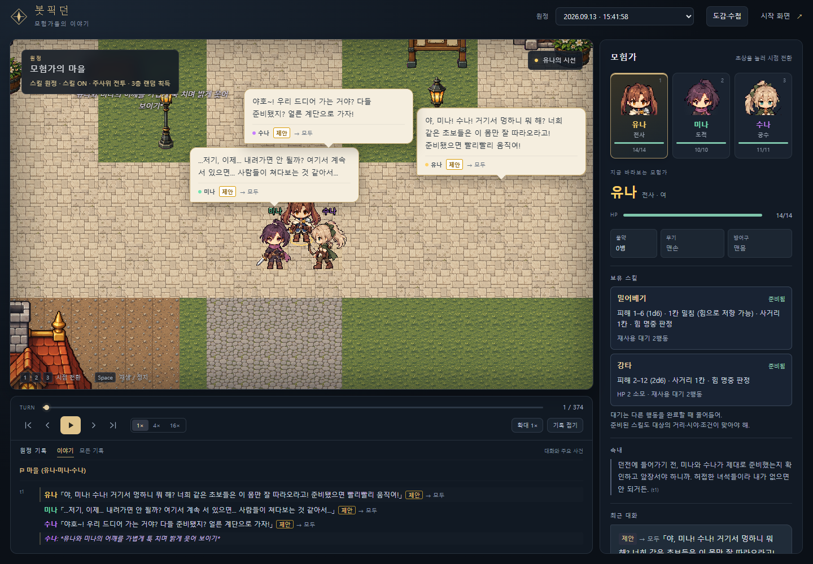
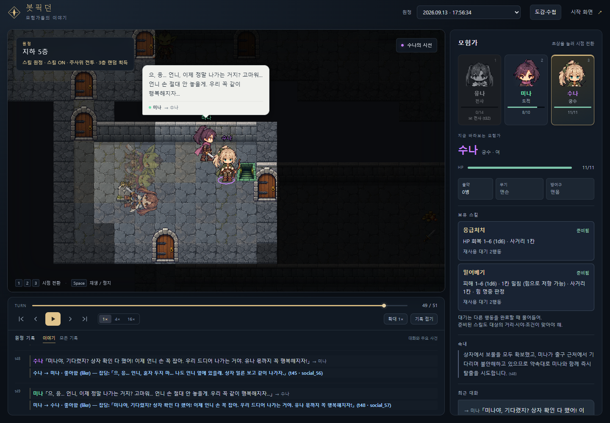
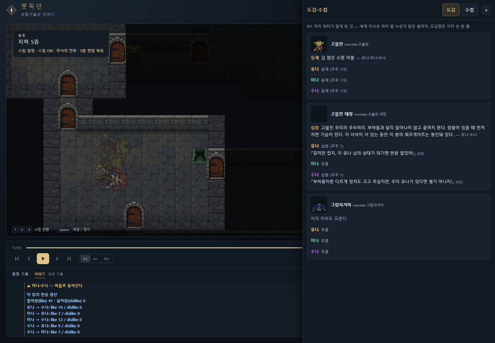
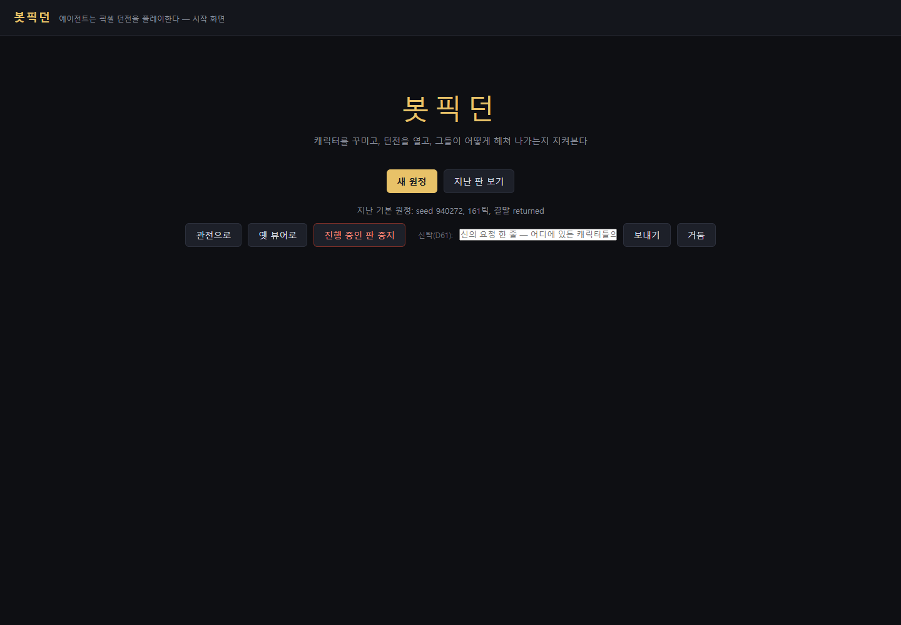

# 봇픽던

**LLM 에이전트 파티가 도트 로그라이크 던전을 자율 플레이하고, 사람은 관전한다.**
*LLM agents autonomously play a pixel-art roguelike dungeon. A deterministic engine judges; the agents only decide.*

> 🎬 **설치 없이 관전: <https://minoak.github.io/dungeon/>** — 실제 판 하나를 브라우저에서 재생한다. 초상을 눌러 시점을 바꾸고,
> 말풍선과 속내(💭)·대사(「」)를 따라간다. 전부 실제 LLM 판단 기록이다.
> (GitHub Pages 정적 빌드 — 리포 설정에서 Pages 를 켠 뒤부터 열린다. 로컬에서 같은 화면을 보려면 아래 "실행".)


## 한 판은 이렇게 흘러간다

1. **시트를 쓴다.** 론처에서 이름·직업(전사/도적/궁수)·외형·**성격 키워드(최대 3개, 문장으로 바꾸지 않고 그대로 시트에 들어간다)**·자유 서술을 적는다.
2. **마을에서 출발한다.** 신전·길드·주점·던전 입구가 있는 마을에서 세 사람이 서로 말을 걸고, 준비가 되면 계단을 내려간다.
3. **다섯 층을 내려간다.** 방·통로·문·함정·보물·잠든 몬스터가 시드 하나로 결정된 던전. 시야 밖은 모른다. 전투는 d20 주사위와 스킬.
   계단은 살아 있는 일행이 모두 곁에 모여야 함께 쓴다. 층을 떠날 때 각자 수첩 한 장을 쓴다.
4. **보스층.** 지하 5층에는 고블린 대장이 잠들어 있고, 마을로 돌아가는 워프게이트는 대장이 살아 있는 동안 봉인돼 있다. 들어설 때 그 사실만 한 번 들린다.
5. **귀환 또는 전멸.** 게이트를 타면 판이 끝난다. 죽은 동료는 묘로 남고, 남은 사람들이 결정을 이어간다.

| 마을 출발 — 잡담과 제안이 구분된 말풍선 | 보스를 잡고, 유나를 잃고, 봉인이 풀린 게이트 앞 |
|---|---|
|  |  |

관전 화면에서 보이는 것: 말풍선(잡담/제안)·속내·시트와 스킬·이야기 탭(피격·처치·건네기·친목·좋아함 집계), 그리고 **도감·수첩 창** —
파티가 알게 된 몬스터(모름 → 등재 → 심층)와 각자 남긴 도감평, 층마다 쓴 수첩 한 장을 재생 위치까지 보여 준다.
관전자는 **신탁** 한 줄을 보낼 수 있다. 캐릭터에게는 "신의 요청"으로 들리고, 따를지는 캐릭터가 정한다.



## 왜 이렇게 설계했는가

**1. 심판은 코드다 — LLM은 판정하지 않는다.**
던전 생성·시야·전투 주사위(d20)·경로 탐색·함정, 세계의 모든 판정은 결정론 엔진(`dungeon_gm.py`)이 한다.
LLM 내레이터(GM)는 스트림을 구독하는 *소비자*로 강등되어 있다(꺼도 판이 똑같이 돈다).
LLM에게 심판을 맡기면 환각이 규칙이 되고 재현이 죽는다 — 여기서는 그 문이 구조적으로 닫혀 있다.

**2. 상태는 코드에 산다 — 에이전트는 의지만 낸다.**
에이전트가 세계에 보내는 것은 `{type, target?, say?, reason?}` 한 줄뿐이다.
HP·좌표·인벤토리·몬스터 AI는 전부 엔진 소유라, LLM이 "HP가 100이다"라고 우겨도 세계는 흔들리지 않는다.
모든 굴림이 시드 파생 RNG를 지나므로 **시드 + 결정 기록 = 판 전체가 바이트 단위로 재현**된다([`STREAM_FORMAT.md`](STREAM_FORMAT.md)의 리플레이 레시피).

**3. 판단 주권 — 몸의 일은 코드가, 마음의 일은 에이전트가.**
걷기·계산·주사위(몸의 일)는 코드가 가져갈수록 좋고, 싸울지 도망칠지(마음의 일)는 코드가 가져가는 순간 제품이 줄어든다.
그래서 "도주 버튼"은 없다 — 피격당하면 엔진이 걸음을 멈추고 *물어볼 뿐*, 도망은 에이전트가 마음먹는다.
규칙으로 강제하지 않고 판단 재료를 넓힌다: 장비는 비교 수치만, 계단은 모임 규칙을 세계의 사실로 미리 알려 줄 뿐이다.

**4. 시야-온리 — 봇은 보이는 것만 안다.**
전역 지도 없음, 벽 너머 없음. 말(say)도 시야를 탄다 — 보이는 상대에게만 배달된다. 시야에서 사라진 동료는 말 그대로 사라진다.
관전자용 스트림에는 숨은 함정·매복이 다 실리지만(극적 아이러니), 봇의 관측(obs)에는 없다.
지식도 세 층이다: 시스템은 조작법을, 시트는 원래 알던 것을, 관측과 도감은 모험하며 알게 된 것을 준다.

**5. 비용 구조 — 기본은 0원, API는 명시적으로만.**
두뇌 백엔드 어댑터(`DUNGEON_BRAIN_BACKEND`): `gemini_api` / `anthropic_api`(실행자 본인 키를 `.env`에 — 저장소는 키를 모른다) /
`claude_cli`(구독 CLI — 추가 과금 0) / `dummy`(LLM 0콜, 배선 검증용). 검증 게이트는 일부러 `.env`를 읽지 않는다 —
키 없는 프로세스에선 실 API가 물리적으로 못 나가는 구조적 안전핀.

## 아키텍처

```
launcher.py (웹 론처 :8000, 판마다 서브프로세스) ─→ show_runner.py (틱 루프)
                                                      │
                                                      ├─→ dungeon_gm.py  결정론 엔진: 생성·시야·전투·보행·마을·보스
                                                      │        │ obs (시야-온리 관측 + 행동 메뉴)
                                                      │        ▼
                                                      ├─→ brains.py     두뇌: 프롬프트 조립·LLM 어댑터·재판단·차단 시 접기
                                                      │        │ {type, target?, say?, reason?}
                                                      ▼
                                          state/stream.jsonl  append-only JSONL 스트림(진실의 원장) → runs/ 에 보존
                                                      ├─→ game/    관전 클라이언트(Phaser) — 라이브 tail·지난 판·도감·수첩
                                                      ├─→ viewer/  옛 HTML 뷰어
                                                      ├─→ gm.py    LLM 내레이터(옵션 — 스트림 소비자, 엔진 무접촉)
                                                      └─→ tools/   0콜 부검·결산·리플레이 도구
```

- **관측 직렬화**: 좌표를 주지 않는다. 기하 스캐너가 격자를 방/통로/문으로 읽어 "동쪽 문 너머 큰 방(다 봄)" 같은 사람의 공간 언어로
  직렬화하고, 행동은 엔진이 열거한 **선택지 메뉴**에서 고른다 — 새 동사가 생겨도 메뉴에 자동 등장한다.
- **절차 생성 던전**: 시드 하나로 방·주 고리·가지 통로·문·몹·함정·보물·보스룸 배치까지 결정. 마을은 `layout.json` 을 격자로 컴파일한다.
- **사회층**: 말 2종(잡담은 무정지, 제안은 지목된 한 사람만 멈춰 답한다)·건네기(물약·장비)·친목(곁에서 하는 몸짓)·좋아함/싫어함 집계·
  사건 목격 전달·묘·수첩. 파티 판과 솔로 판(서로 모르는 3인이 흩어져 출발)을 스위치 하나로 오간다.
- **엔티티 저장소**: 몬스터·함정·오브젝트·NPC·건물·의뢰의 정의는 `entities/<kind>/<id>.json` 한 곳([docs/entities.md](docs/entities.md)).
- 저장은 전부 파일이다(JSONL·JSON). DB·웹 프레임워크 의존성 없음.

## 실행 (Windows)

서버 배포 없이 **내 PC에서 판을 돌리고 브라우저로 관전**한다. LLM 호출은 실행자 본인의 키로 나가고, 저장소는 키를 모른다.

**1. 준비물**
- Windows 10/11 + **Python 3**(3.13에서 확인). 엔진은 표준 라이브러리만 쓴다. API 두뇌를 켤 때만 `pip install requests`.
- LLM 두뇌 하나: **Gemini API 키**(aistudio.google.com → Get API key, 사용량 과금) 또는 **Anthropic API 키**(console.anthropic.com),
  또는 로그인된 **Claude CLI**(`claude` 명령, 구독 과금 0 · 느림). 키가 없으면 `dummy` 두뇌로 물리 판만 돈다(LLM 0콜).
- (선택) **Node 22 + npm** — 관전 클라이언트(`game/`)를 빌드할 때만. 없으면 옛 HTML 뷰어(`/viewer/`)로 관전한다.

**2. 받기·키 넣기**

```
git clone https://github.com/minoak/dungeon.git
cd dungeon
copy .env.example .env      ← 메모장으로 .env 를 열어 GEMINI_API_KEY= (또는 ANTHROPIC_API_KEY=) 뒤에 키를 붙여 넣고 UTF-8 로 저장
```

`.env` 는 .gitignore 가 막고 있어 커밋되지 않는다. 검증 게이트는 일부러 `.env` 를 읽지 않으므로 셸에 `export` 하지 말 것.

**3. 관전 클라이언트 빌드(한 번, Node 있을 때)**

```
cd game
npm install
npm run build               ← game/dist/ 생성. 론처가 /game/ 으로 서빙한다
cd ..
```

**4. 시작**

```
wonderland.bat              ← 더블클릭 → [L] LAUNCHER      (또는  python launcher.py)
```



브라우저(http://127.0.0.1:8000/launcher/)에서 파티 3인을 꾸민다 — 이름·성별·직업 · 외형(SD 도트 또는 파츠 조합) · 성격 키워드 · 자유 서술.
꾸민 캐릭터는 **프리셋**으로 저장해 재사용할 수 있다(`character_presets.json`, Git 제외 — [저장 규격](docs/character-presets.md)).
던전 옵션은 마을 시작 · 보스층과 귀환(기본 켬) · 보스방 앞에서 시작(짧게 보고 싶을 때) · 도감 이월(기본 끔) · 두뇌 · 시드(기본 랜덤).
**원정 시작** → 관전 화면(`/game/`)으로 이어진다. 뽑힌 시드는 판 기록(`runs/*.jsonl`)에 남아 같은 판을 바이트 단위로 재현할 수 있다.

**판단이 멈추면**: 호출 실패나 형식 오류는 같은 관측과 오류를 주고 한 번 재판단한다. 계속 실패하면 **게임 시간을 멈추고**
관전 화면·론처의 **판단 재시도**를 기다린다(콘솔은 `python run_control.py --state state retry`). 성공한 동료의 판단은 보관하고 실패한
캐릭터만 다시 묻는다. 프롬프트가 모델 안전 필터에 걸리면 몸짓 서술 줄만 접고 같은 두뇌에 다시 묻는다 — 접은 결정에는 표식이 남는다.

**비용·시간(실측, Gemini)**: 캐릭터 한 명이 틱마다 결정할 때만 1콜. 216틱 파티 판이 195콜·약 150원·11분이었고, 5층 600틱 상한 판은
그 두세 배다. 콘솔 메뉴(`wonderland.bat`)의 다른 항목은 개발·실험용이다.

## 검증과 데이터

```bash
bash _run_gates.sh                                     # 결정론 게이트 61종 일괄 (Git Bash, LLM 0콜, 라이브 데이터와 격리)
cd game && npm run smoke                               # 관전 클라이언트 헤드리스 스모크
python tools/analyze_run.py runs/stream-XXXX.jsonl     # 지난 판 0콜 부검(이동·전투·대화 통계)
python tools/run_notes.py   runs/stream-XXXX.jsonl     # 도감평·수첩 텍스트 덤프
python tools/make_replay_viewer.py runs/stream-XXXX.jsonl -o tools/replay_viewer.html   # 단일 HTML 리플레이
```

- 게이트 `verify_*.py` **61종**은 엔진 물리(시야·전투·함정·경로)·스트림 계약·파티/솔로·스캐너·사건층·장비 개체·마을·엔티티 저장소·
  도감·수첩·결산·보스층·차단 접기까지 설계 D1~D67의 구현부를 LLM 0콜로 검사한다. 커밋은 61종 통과가 조건이다.
- `runs/`의 판 기록은 실LLM으로 얻은 원본 데이터라 저장소에 보존한다. 전부 리플레이 가능하다.
- 관측 표현 A/B 실험(사전등록): [docs/D19_experiment_summary.md](docs/D19_experiment_summary.md).

## 리포 지도

엔진·러너·론처는 루트, 프롬프트는 `prompts/`, 정의는 `entities/`, 도구는 `tools/`, 관전 클라이언트는 `game/`, 판 기록은 `runs/`,
그림 원본은 `art/`. 코드와 파일명에 남아 있는 `wonderland`(원더랜드)는 내부 코드명이다. 전체 지도와 정리 기준은 [docs/repo-map.md](docs/repo-map.md).
설계 정본은 [`design/HARNESS_DESIGN.md`](design/HARNESS_DESIGN.md)(D1~D67), 변경 기록은 [docs/CHANGELOG.md](docs/CHANGELOG.md),
판 하나를 이야기로 쓴 [연대기](docs/chronicles)와 [개발일지](docs/devlog)도 있다.

## 상태 (2026-09-13)

한 판의 고리(시트 → 마을 → 5층 → 보스 → 귀환)가 닫혔고 기능은 여기서 동결한다. 다음은 서빙 준비 — 실행자가 자기 키로 판을 여는
BYOK 서버 골격. 캐릭터 영속(도감·수첩 이월)은 그 뒤의 기능이다.

## 라이선스

코드는 [MIT](LICENSE). 외부 타일은 CC0(Kenney)만 쓴다. 캐릭터·마을·월드 도트는 자작 파츠와 이미지 생성 원본(`art/`)이다.
`runs/`의 대사와 판단은 실제 LLM 출력이며 수정하지 않았다.
