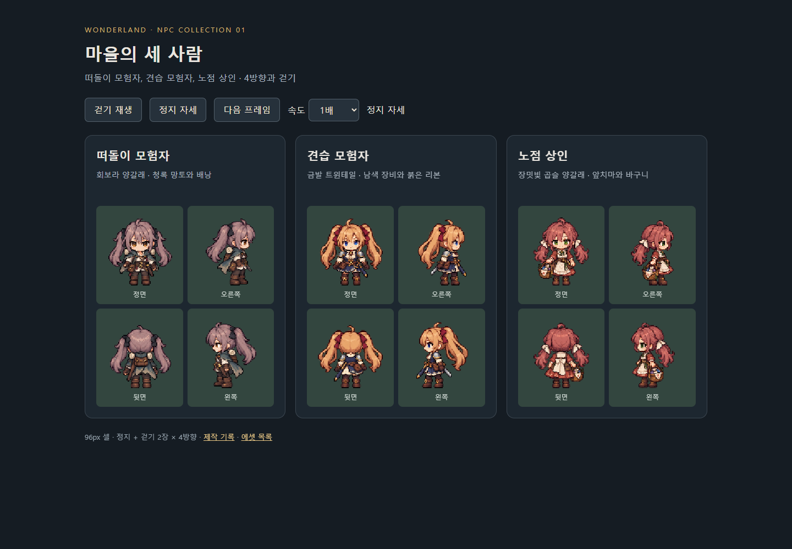
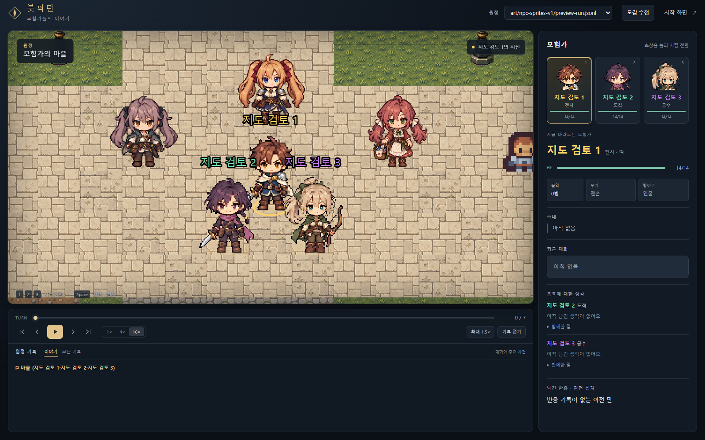

# 마을 행인 3종 · 여성 SD 캐릭터

2026-09-15. 승인된 `../npc-concepts-v1/` 정면 시안을 기반으로 제작했다.
여성 캐릭터, 트윈테일, 서브컬처풍 큰 눈과 SD 비율을 유지하고 기존 원더랜드 캐릭터 크기에 맞췄다.



## 결과

| NPC | 외형 | 런타임 파일 | 텍스처 |
|---|---|---|---|
| 떠돌이 모험자 | 회보라 낮은 양갈래, 청록 망토, 배낭 | [npc-wanderer.png](runtime/npc-wanderer.png) | wl-npc-wanderer |
| 견습 모험자 | 금발 높은 트윈테일, 남색 장비, 붉은 리본 | [npc-apprentice.png](runtime/npc-apprentice.png) | wl-npc-apprentice |
| 노점 상인 | 장밋빛 곱슬 양갈래, 앞치마, 바구니 | [npc-vendor.png](runtime/npc-vendor.png) | wl-npc-vendor |

각 시트는 **288×384 RGBA PNG**, **96×96 셀**, **3열×4행**, 발 기준 **y=91**이다.
행은 정면 → 오른쪽 → 뒷면 → 왼쪽, 열은 정지 → 걷기 A → 걷기 B이다.
걷기는 A → 정지 → B → 정지(기본 프레임당 125ms), 총 36개의 원본 프레임이다.
정확한 목록은 [manifest.json](runtime/manifest.json), 크기와 정렬은 [build-report.json](build-report.json)에 보존한다.

## 열기

`preview.html`은 이미지 파일과 함께 로컬에서 열거나 아래 명령으로 볼 수 있다.

```powershell
python -m http.server 4218 --bind 127.0.0.1 --directory art/npc-sprites-v1
# http://127.0.0.1:4218/preview.html
```

정지 자세, 걷기 재생/정지, 한 프레임씩 넘기기, 속도 변경을 지원한다.

## 게임 연결

- `game/src/assets/npcs.ts`에서 세 시트를 Vite 에셋으로 로드한다. 빌드 산출물에 해시 파일로 포함된다.
- 현재 스트림에는 NPC 정의 id가 없으므로 엔티티 JSON의 이름과 스냅샷의 이름을 맞춘다. 실제 이동 중에는 숫자 인스턴스 id로 같은 스프라이트를 유지한다.
- `DungeonScene.ts`는 스냅샷의 좌표 변화로 방향과 걷기를 결정한다. 도착하면 해당 방향의 정지 프레임으로 돌아온다.
- 되감기/층 변경에서는 즉시 위치를 맞추고 정지한다. NPC 말풍선은 이동하는 스프라이트 위치를 따른다.
- 기존 고정 NPC, 미등록 외형의 기본 타일, 숨김/시야 규칙을 유지한다. 현재 행인 세 이름이 있는 기존 리플레이에도 적용된다.
- 엔진 행동, 대사, 성격, 충돌, 등장 조건은 변경하지 않는다.



`preview-run.jsonl`은 town-v2 지도에 위치를 통제한 검토용 기록이다. 실제 LLM 플레이 기록이 아니다.

## 제작과 검증

그림 제작: **내장 image_gen**. 각 `*-prompt.txt`가 실제 생성 프롬프트이며, `*-source.png`는 수정 없는 생성 원본이다.
이미지 참조 1은 승인된 정면 시안, 참조 2는 `viewer/assets/sprites/sd/warrior-twintails.png`이다.
`pack.mjs`는 투명 여백으로 셀을 분리하고, 공통 배율로 최근접 축소한 뒤 발 위치를 맞춘다. 새 그림을 코드로 그리지 않는다.

```powershell
node art/npc-sprites-v1/pack.mjs
node art/npc-sprites-v1/verify.mjs
cd game
npm run build
```

- 세 시트·36프레임 로드와 잘림 없는 셀 배치를 확인했다.
- 네 방향 이동, 도착 정지와 깊이 정렬, 되감기, 16배 재생, 숨김 후 재등장, 기존 NPC 및 기본 타일, 말풍선 앵커를 검증했다.
- 미리보기의 조작과 390px 모바일 너비를 확인했다. 상세 결과: [verification.json](verification.json).
- TypeScript + Vite 빌드 통과. 독립 포트에서 기존 관전 스모크 31개 통과, 실패 0개(라이브 전용 배지 검사 1개는 리플레이에서 생략).
- 걷기는 2장의 짧은 루프다. 정밀한 장편 애니메이션이 아니며 방향별 머리와 소품의 미세한 차이는 남아 있다.
