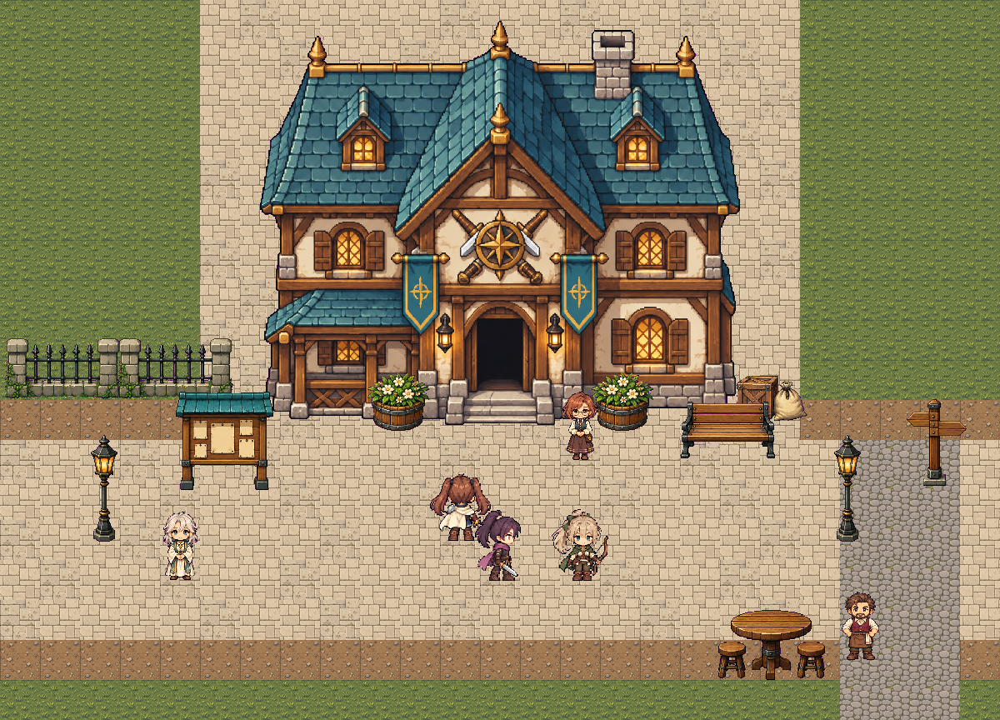

# 원더랜드 마을 에셋 1차 — 번화가와 길드 입구

2026-09-11. 사용자가 맡긴 첫 마을 에셋 작업. 기존 SD 모험가와 함께 배치할 최소 묶음이다.



## 결과

- 모험가 길드 외관 1동: 청록 지붕·밝은 회벽·목재, 아래쪽을 향한 정면 출입구.
- 바닥·건축 타일 8종: 밝은 석재길 2변형, 샛길, 흙, 잔디, 목재 바닥, 회벽, 청록 지붕.
- 소품 8종: 가로등, 게시판, 벤치, 화분, 이정표, 울타리, 상자와 자루, 탁자와 의자.
- NPC 3종 × 4방향 정지 외형: 성직자, 길드 접수원, 주점 주인. 이름·성격·행동 규칙은 아직 부여하지 않았다.
- 기존 모험가 3인의 변경 없는 시트 사본을 배치 비교에 사용했다.
- `preview.html`: 격자, 소품/인물 표시, NPC 방향, 연결 방향을 바꿔보는 독립 미리보기.

이는 여섯 구역 중 번화가와 길드 입구의 **외형 배치 시안**이다. NPC와 모험가는 크기 비교용 정지 배치이며, LLM 플레이 기록이 아니다. 신전·주점 외관과 실내 맵, 던전 입구, NPC 걷기 애니메이션, 실제 포탈·충돌·자율 이동은 이번 묶음에 포함하지 않았다.

## 열기

저장소 루트에서:

```powershell
python -m http.server 4198 --bind 127.0.0.1 --directory art/town-v1
```

브라우저에서 `http://127.0.0.1:4198/preview.html`을 연다. `layout.json`을 읽으므로 HTML 더블클릭 대신 HTTP로 연다. 게임 런처와 LLM은 필요 없다.

## 파일과 규격

| 파일 | 규격 | 용도 |
|---|---|---|
| `runtime/terrain.png` | 192×96, 셀 48, 4열×2행 | 지형 아틀라스 |
| `runtime/guild.png` | 576×485, RGBA | 길드 외관 |
| `runtime/props.png` | 576×288, 셀 144, 4열×2행 | 소품, 셀 내 발 기준 (72,138) |
| `runtime/npcs.png` | 384×288, 셀 96, 4열×3행 | 행별 NPC, 열별 방향, 발 기준 (48,91) |
| `runtime/manifest.json` | JSON | 그림 참조·프레임 이름·표시 규격 |
| `layout.json` | 25×18칸, 칸당 48px | 시안의 바닥·외관·인물·소품 배치 |
| `scene.png` / `scene-grid.png` | 1200×864 | 원래 크기의 렌더링과 격자 확인본 |
| `preview-desktop.png` / `preview-tablet.png` | 화면 캡처 | 미리보기 UI 검토본 |

NPC 열 순서는 정면→오른쪽→뒷면→왼쪽이다. 기존 모험가 시트의 행=방향·열=애니메이션 규격과 **서로 다르므로** 바로 기존 SD 플레이어 시트로 등록하지 않는다. NPC 한 행이 같은 사람의 4방향 정지 모습이다. NPC마다 공통 축소 배율을 사용해 방향에 따라 몸이 커졌다 작아지지 않게 했다.

길드 건물은 발 기준으로 배치한다. 그림의 지붕까지 전부 통행 불가로 쓰지 말고 실제 바닥 점유와 출입구를 별도로 정의해야 한다. 현재 시안의 번화가는 5칸, 샛길은 3칸 폭이며 이는 최종 마을 크기 결정이 아니다.

## 엔티티 작업과의 접점

2026-09-11 후속 작업: `layout.json`에 명시적 충돌 사각형·출입구·출발점·던전 진입점·NPC id와 칸 좌표를 추가했다. `python art/town-v1/to_ascii.py`로 아스키와 후보 JSON을 생성하며, 미리보기의 **통행 불가 영역과 배치 칸**으로 그림과 대조할 수 있다. NPC와 모험가 발 위치는 칸 중심에서 계산한다. 자세한 접점과 미연결 범위는 [LAYOUT_CONTRACT.md](LAYOUT_CONTRACT.md), 생성 출력은 [town-ascii.txt](town-ascii.txt)다. 기존 레이아웃의 탁자는 샛길을 막지 않도록 왼쪽 빈터로 옮겼다.

`python art/town-v1/verify_layout.py`에서 모든 출발점→문턱·NPC·진입점의 경로와 실제 엔진 격자 일치를 확인했다. 현행 `check_town.py`의 최종 등록 검사는 새 NPC 정의 3종이 없어 아직 실패한다. 루트의 `town_layout.py`는 엔진 비의존 변환 함수이며 보호 중인 엔진 파일의 `from_layout` 연결은 별도 작업이다.

`runtime/manifest.json`은 외형 자산 목록이며 엔티티 저장소의 새로운 스키마가 아니다. 맵·건물·NPC 엔티티에서 이 그림과 프레임을 참조하도록 후속 작업에서 연결한다. 게임 코드, 현재 런타임 월드 자산, `entities/`는 변경하지 않았다. 보호 요청을 받은 `dungeon_gm.py`, `composed_actions.py`, `brains.py`도 수정하지 않았다.

## 생성과 재현

그림은 모두 **내장 imagegen**으로 생성했다. 기존 `viewer/assets/sprites/sd/warrior.png`를 길드와 NPC의 스타일 참조로 사용했다. 원본은 `source/`, 실제 사용한 프롬프트는 아래에 있다.

1. `prompts/guild.txt` → 최초 길드 시안. 투명도 대신 체크무늬가 그려져 `source/guild-checker-rejected.png`로 보존하고 런타임에서는 제외했다.
2. `prompts/guild-key.txt` → 배경을 마젠타 단색으로 정리한 길드.
3. `prompts/terrain.txt` → 8종 지형 시트.
4. `prompts/props-key.txt` → 8종 소품 시트.
5. `prompts/npcs-key.txt` → NPC 3명의 방향 시트.

`props.txt`와 `npcs.txt`는 실행 전 작성한 투명 배경 프롬프트 초안이다. 실제 생성에는 키 배경 버전을 사용했다. 새로운 그림 제작·수정은 imagegen이 수행했고, 패킹 코드는 기존 `art/world-v1`과 같은 방식으로 키 색을 알파로 변환하고, 셀을 자르고, 최근접 축소와 발 위치 정렬만 수행한다. 이미지 원본은 덮어쓰지 않는다.

```powershell
node art/town-v1/build.mjs
node art/town-v1/verify.mjs
```

패킹에는 Node와 sharp, 화면 검증에는 `game/node_modules/playwright-core`와 설치된 Edge를 사용한다. sharp가 프로젝트에 없으면 기존 월드 에셋 도구와 같은 Codex 번들 경로를 사용한다. 검증 서버는 작업 후 자동 종료된다.

검사 결과는 `build-report.json`과 `verification.json`에 남겼다. 빈 프레임·원본 경계 접촉·축소 후 잘림·투명도·키 색 잔존, 이미지 로드, 미리보기 토글, 방향 전환, 데스크톱/태블릿 가로 넘침, 브라우저 오류를 확인했다. LLM 게임 호출은 0회다.

## 시각 검토와 남은 보완

기존 모험가와 입구 크기를 비교했고, 객체가 체크무늬나 키 색 사각형 없이 배치되는 것을 확인했다. NPC는 기존 모험가보다 몸과 얼굴 폭이 가는 인상이며, 정지 키는 같은 범위로 맞췄다. 방향에 따른 의상은 1차 검토를 통과했지만 실제 걷기 연속성은 아직 없다.

지형은 반복 배치 가능한 개별 사각 타일이다. 잔디·흙·포장 사이의 경계 전용 타일이나 자동 연결 타일은 아직 없고, 석재 변형 사이의 줄눈도 모든 조합에서 완전히 이어지는 규격은 아니다. 이 시안으로 분위기와 크기를 확인한 뒤 구역을 확장하면서 경계와 반복감을 다듬는다.
