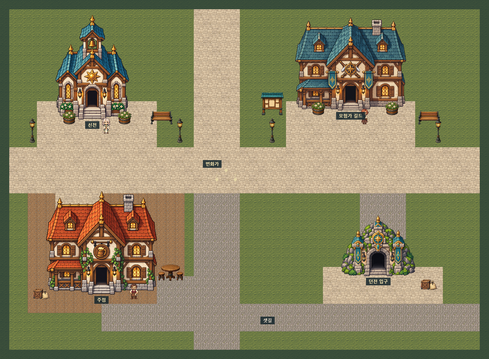

# 마을 전체 맵 v2

신전·모험가 길드·주점·던전 입구와 번화가·샛길을 잇는 외부 마을이다. 구역 6개, 건물 4동, NPC 3명.
`town.json`에 연결되어 새 원정에서 사용한다. 실내·의뢰·신탁·NPC의 새 서비스는 포함하지 않는다.

- 저작: `layout.json` + `../../entities/map/` + `../../entities/building/`
- `export.py`: 위 정의를 읽어 `compiled.json`, `town-ascii.txt`를 갱신한다.
- `preview.html`: 경계·충돌·경로를 볼 수 있는 지도 검토 화면. 게임 플레이 로그가 아니다.
- `map-overview.png`, `map-regions.png`, `map-collision.png`: 브라우저에서 캡처한 지도 출력.
- `source/`: 내장 이미지 생성 도구의 투명 배경 원본. 길드 이미지를 스타일 참고로 생성한 신전·주점·입구.
- `pack.mjs`: 원본의 알파 여백만 잘라 최근접 크기 조절, `runtime/`과 게임 에셋 폴더로 패킹한다.
- `build_layout.py`: 최초 배치 생성 기록. 수작업으로 정의를 고친 뒤에는 재실행하지 않고 `export.py`를 쓴다.
- `verify-browser.mjs`: 지도 렌더링·표시 전환·경로·반응형 검사와 PNG 내보내기.

기존 길드, 바닥 타일, 소품, NPC 외형은 `../town-v1/runtime/`을 재사용한다.
상세 계약은 [구역·건물 엔티티](../../docs/town-spaces.md), 결산 변경은 [이동·대기 집계](../../docs/movement-summary.md).
