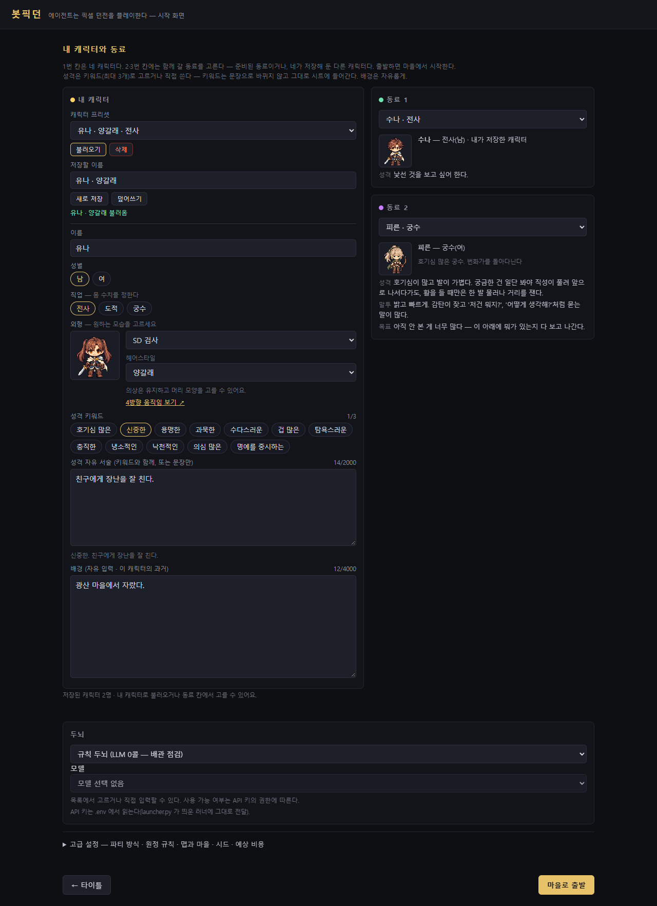

# 캐릭터 프리셋 (2026-09-09)

2026-09-11: 성격 자유 서술은 **2,000자**, 배경은 **4,000자**까지 쓸 수 있다.
성격 키워드와 자유 서술을 합친 성격 줄은 최대 2,500자까지 러너와 프롬프트에 전달한다. 저장·복원도 같은 상한을 사용한다.

캐릭터 한 명의 생성 설정을 저장하고 원하는 파티 칸에 불러온다. 사용자 목표는 나중에 사용자가 정하는
방향으로 열어 둔다. 현재 생성 입력에 목표 항목을 새로 만들거나 직업 목표를 자동 부여하지 않는다.

## 사용

1. 론처 → 새 원정 → 커스텀 파티에서 이름·성격 등 캐릭터 설정을 채운다.
2. 카드 상단의 **새로 저장**을 누른다. 저장할 이름은 생략하면 캐릭터 이름을 쓴다.
3. 다음 원정에서는 원하는 카드의 목록에서 프리셋을 고르고 **불러오기**를 누른다.
4. 불러온 캐릭터를 고친 뒤 **덮어쓰기**하면 선택한 저장본을 수정한다. **새로 저장**하면 별도 버전이 된다.

편집 중인 캐릭터와 저장본은 분리된다. 불러와서 헤어를 바꾸는 것만으로 저장본이나 다른 파티 칸이
바뀌지 않는다. **삭제**도 저장 목록에서만 지운다. 프리셋에는 초기 설정만 담으며 판에서 쌓인 관계·기억은 담지 않는다.

## 저장과 다음 클라이언트 연동

`character_presets.py`가 커스텀 파티 파일과 같은 폴더의 `character_presets.json`을 관리한다.
기본 위치는 저장소 루트다. 브라우저 저장 공간에 의존하지 않으므로 론처 재실행 후에도 남는다.
개인 파일로 Git에서 제외하므로 백업·다른 컴퓨터로 이동할 때 이 파일을 따로 복사한다.

파일 최상위 형식은 `{ "version": 1, "presets": [...] }`이며 각 항목은 다음과 같다.

| 필드 | 의미 |
| --- | --- |
| `id` | 저장본을 식별하는 문자열. 새 저장 시 서버가 발급한다. |
| `label` | 목록에 보일 이름, 최대 40자. 같은 이름도 다른 `id`로 저장 가능하다. |
| `slot` | `name`, `sex`, `job`, `traits`, `persona`, `background`, `look`을 담은 생성 입력. |

`slot.persona`는 사용자가 직접 쓴 성격 문장이다. 키워드는 파티 조립 시 문장으로 바뀌지 않고 그대로
성격 줄 앞에 붙는다(2026-09-12: `신중한, 겁 많은. <자유 서술>` — 프롬프트에는 `- 성격: 신중한, 겁 많은. …`
으로 나간다, 말투 문장은 붙지 않는다). 완성된 `party_custom.json`의 합쳐진 `persona`를 그대로 복사해
넣으면 키워드가 중복될 수 있으므로 다음 클라이언트도 생성 입력을 저장해야 한다. 외형은 기존 `look` 규격을 그대로 쓰며
`sprite`와 `hairstyle`을 포함한다. 직업 수치는 불러온 설정으로 파티를 만들 때 현재 직업 사전에서 조립한다.

| API | 요청 / 응답 |
| --- | --- |
| `GET /api/characters` | `{ "presets": [{id, label, slot}, ...] }` |
| `POST /api/characters` | `{slot, label?}`로 새 저장, `{id, slot, label?}`로 덮어쓰기 → `{ "preset": {id, label, slot} }` |
| `POST /api/characters/delete` | `{id}` → `{ "ok": true }` |

다음 클라이언트는 이 API로 목록을 읽고, 선택한 `slot`의 복사본을 편집하면 된다. 파티를 확정할 때는
기존 `POST /api/party`에 `{slots:[...]}`를 보낸다. API는 기존 캐릭터 입력 검증을 사용하고,
파일은 임시 파일 쓰기를 완료한 뒤 교체한다. 잘못된 입력·읽기 오류·쓰기 실패가 기존 저장본을 지우지 않는다.

## 검증

`python verify_character_presets.py`: 저장·재로딩·별도 버전·수정·삭제·잘못된 입력·쓰기 실패·동시 저장·파티 API 연동.
임시 폴더를 사용하고 LLM을 호출하지 않는다. `_run_gates.sh`에도 포함된다.

PowerShell에서 `$env:WL_BROWSER='1'; python verify_character_presets.py`로 브라우저 검증까지 실행할 수 있다.
Node와 Playwright가 필요하며 `WL_NODE`로 Node 실행 파일을 지정할 수 있다. Windows에서는 Edge를 사용한다.
브라우저 재접속, 다른 칸 복원, 성격·헤어 유지, 모바일 폭, 실제 파티 저장을 확인한다.

## 판 기록과 캠페인(D78, 2026-09-16)

파티를 확정할 때 론처는 `POST /api/party` 에 `{slots, preset_ids}` 를 보낸다. `preset_ids` 는 슬롯과 같은 순서의 저장 캐릭터 `id`(불러오기·저장한
칸만, 아니면 빈 문자열)다. 서버는 **이 저장소에 있는 id 만** 시트에 붙이고(`party_custom.json` 의 `id`), 러너가 그것을 `run_meta.party[].id` 로 남긴다.
그 id 가 캠페인(`campaign.json`, 같은 폴더)과 도감 원장(`bestiary.json`)의 키다. 저장하지 않은 즉석 캐릭터와 기본 파티는 1회용이라 기록이 남지 않는다.

| API | 요청 / 응답 |
| --- | --- |
| `GET /api/characters` | 응답에 `campaign{id: 요약}` 가 additive 로 붙는다(기록 있는 저장 캐릭터만, 항목 자체는 그대로): 요약 = `{runs, running, stopped, by_outcome{}, deaths, depth_max, last{started, status, outcome, depth_last, turn_last, label}}` |
| `GET /api/characters/log?id=<id>` | `{id, runs:[{run_id, seed, started, status(running|stopped|ended), outcome, depth_last, depth_max, turn_last, alive_last, died_turn, quests_done[], party[], pages[{turn, depth, text}], book_lines[{turn, key, text}]}]}` 최근 것부터 |

캠페인은 판 기록을 **마지막 줄까지** 읽어 접는다(끊긴 판도 끊긴 자리까지, 진행 중인 판은 running). 러너는 이 파일을 모르고, `python campaign.py` 없이도
`launcher.Ctx.campaign_refresh()` 가 `/api/characters` 때 갱신한다. 검증: `python verify_campaign.py`.
