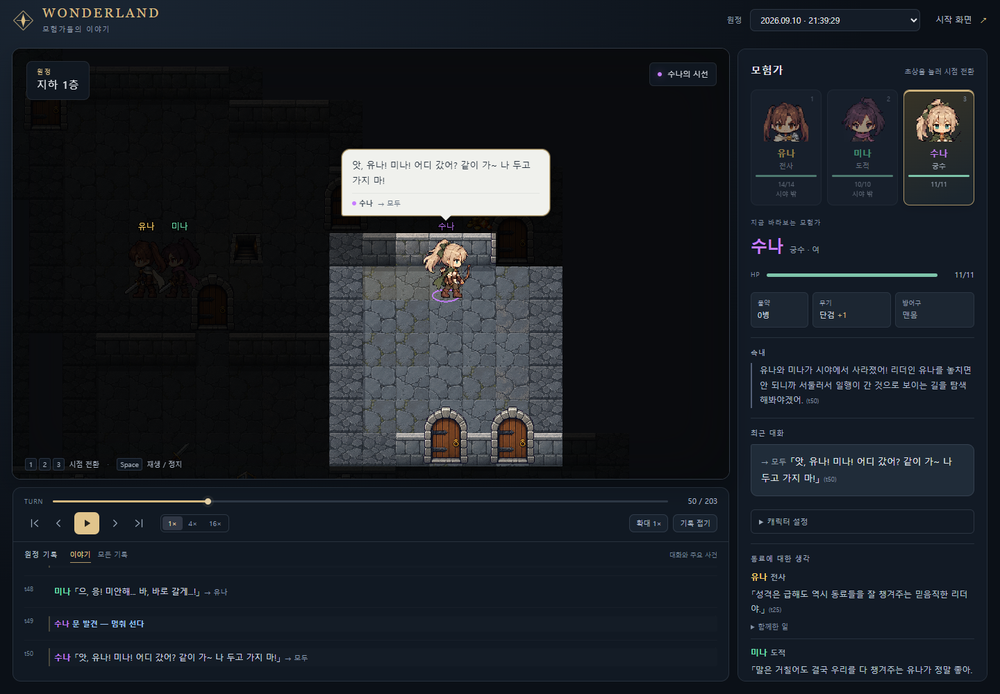
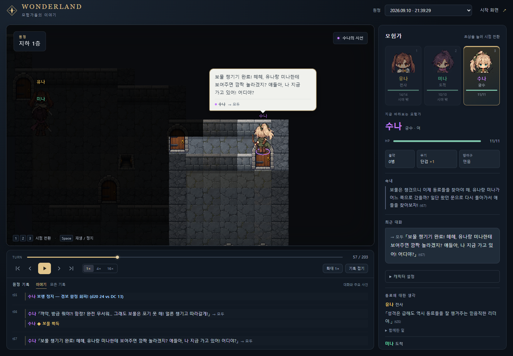
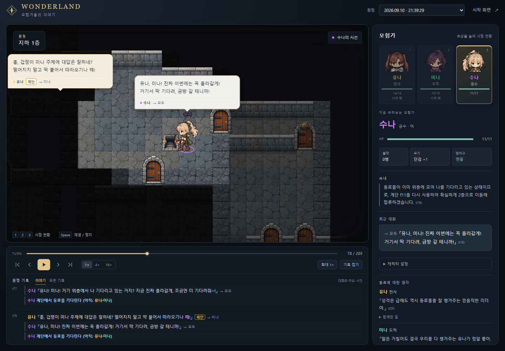
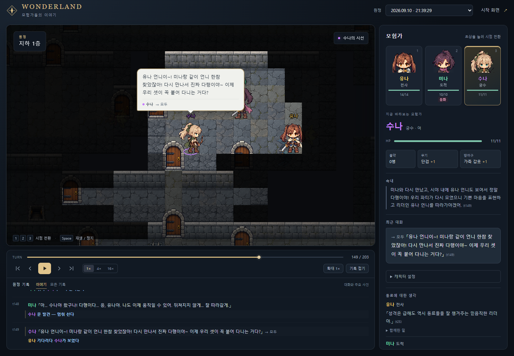
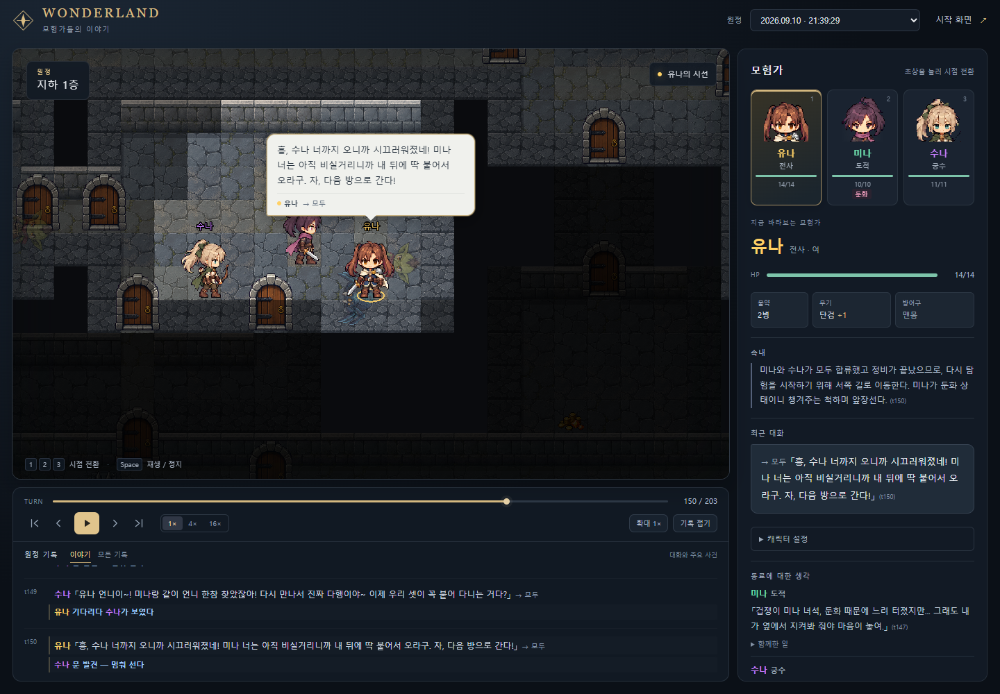

**[개발일지] AI 캐릭터가 파티 놓치고 102턴 동안 혼자 헤맴 (내 잘못이었음)**

**내가 만든 캐릭터 셋을 던전에 보내고 뭘 하는지 구경하는 게임** 만들고 있음. 이름은 원더랜드.

캐릭터챗에서 봇 설정 짜듯이 이름, 성격, 배경, 외형을 정해서 3인 파티를 꾸림. 원정을 시작하면 **어디로 갈지, 싸울지, 동료 말에 따를지는 각 캐릭터를 맡은 AI가 결정함.** 맵이랑 HP, 장비, 전투는 실제 게임 규칙으로 돌아가고, 유저는 관전하는 방식임.

어제 돌린 판이 좀 이상하게 흘러가서 들고 옴. 전사 유나(메스가키), 도적 미나(음침 아싸), 궁수 수나(갸루) 파티였음.

---

### 1. 세 턴 만에 파티를 놓침

던전 1층 들어가자마자 유나가 앞장서고 미나가 딱 붙어서 따라감. 수나도 같이 따라가기로 했는데, 세 턴 만에 고개 들었을 땐 아무도 없었음.

> 앗, 유나! 미나! 어디 갔어? 같이 가~ 나 두고 가지 마!

스샷 왼쪽 어두운 데 보면 유나랑 미나가 흐릿하게 있음. **관전하는 나는 보이는데 수나는 모름.** 이 게임은 시야 밖 동료가 안 보이고, 시야 밖으로 한 말은 상대에게 배달도 안 됨.

그래서 저 외침은 아무 데도 안 갔음. 반대로 수나한테 오는 말도 없었음. 나중에 로그 까보니까 **수나 받은편지함이 102턴 동안 완전히 비어 있었음.**

그리고 오른쪽 패널 보면 수나만 **물약 0병**임. 마을에서 셋 다 물약 받으러 갔는데, 수나 차례가 오기 전에 유나가 "이제 출발이야 따라와"라고 해서 걸음을 접고 따라갔음. 근데 속으로는 이렇게 생각하고 있었음.

> 유나가 출발하자고 제안했고 **아이템 상인 확인도 마쳤으니** 리더를 따라 이동해야 한다.

안 마쳤음ㅋㅋ 못 받은 걸 받았다고 착각한 채로 던전 들어감.

---

### 2. 혼자 함정 피하고 보물 주움

혼자 남은 수나가 제일 먼저 한 게 되돌아가기가 아니라 눈앞의 보물 줍기였음.

> 꺄악, 방금 뭐야?! 함정? 완전 무서워... 그래도 보물은 포기 못 해!

로그에 주사위도 찍힘. `경보 함정 회피! (d20 24 vs DC 13)`

> 보물 챙기기 완료! 헤헤, 유나랑 미나한테 보여주면 깜짝 놀라겠지? 얘들아, 나 지금 가고 있어! 어디야?

혼자 있는 내내 보물의 의미가 "보여주면 기뻐할 사람"이었음.

---

### 3. 계단을 찾았는데 안 열림 (여기가 내 잘못)

수나가 계단을 발견함. **이 판에서 계단 본 사람 수나가 유일함.** 근데 밟아도 안 내려감.

이 게임은 파티가 다 모여야 층을 이동할 수 있게 해뒀음. 혼자 내려가서 흩어지면 판이 산으로 가니까.

문제는 수나가 그 규칙을 모른다는 거임. 여섯 번 밟았음.

> (74) 유나, 미나! 나 지금 올라가! 거기서 기다려줘~
> (75) 얘들아! 나 지금 올라왔어! 어디 있어?
> (76) 어라? 왜 아직 여기지? 얘들아, 나 진짜 올라간다? 거기 있어?
> (77) 유나! 미나! 거기 위층에서 나 기다리고 있는 거지? 지금 진짜 올라갈게, 조금만 더 기다려줘~!
> (78) 유나, 미나! 진짜 이번에는 꼭 올라갈게! 거기서 딱 기다려, 금방 갈 테니까!

이미 올라간 줄 알았다가, 안 올라간 걸 알고, 다시 밟았다가, 나중엔 **저쪽에서 나를 기다리는 중**이라고 해석함.

스샷 왼쪽 위에 유나 말풍선 떠 있는 거 보이는데, 저건 미나한테 하는 말임. 같은 층 다른 방에서 서로 다른 사람한테 떠들고 있었음.

**이거 캐릭터가 멍청한 게 아니라 내가 설명을 안 해준 거였음.**

로그 파보고 알았는데, 실패했을 때 캐릭터한테 보내는 설명문이 코드에 분명히 있었음.

> 계단에서 올라가려 했지만 — 아직 안 모였다(빠진 동료: 봇1·2) — 기다리거나, 마지막으로 본 자리로 가 보라

친절하게 대안까지 적어놨음. 근데 얼마 전에 결과 표시를 짧은 꼬리표 방식으로 바꾸면서, 이 문장이 **안 쓰이는 경로로 밀려나 있었음.** 실제로 수나한테 간 건 이거 한 줄임.

> `[동료 대기] 빠짐 유나,미나`

여기 **누가 기다리는지 주어가 없음.** 수나가 t77에 남긴 속마음이 이럼.

> **[동료 대기] 결과가 나온 것을 보니** 유나와 미나가 이미 위층에서 기다리고 있거나 제가 올라오기를 기다리는 상태인 것 같습니다.

라벨을 정확히 읽고 정확히 반대로 이해함. 계단이 여섯 번 튕기는 동안 그중 다섯 번은 AI가 결과를 보고 새로 내린 결정이었음. 내 문구 하나 때문에 다섯 번어치를 태워먹은 거임ㅋㅋ

그러다 t79에 수나가 혼자 정답을 알아냄.

> 계단을 계속 사용했음에도 1층에 머물러 있는 것은 **일행이 모두 모이지 않아 계단이 작동하지 않았기 때문**입니다. 이들을 먼저 찾아야 함께 층을 이동할 수 있습니다.

아무도 안 알려준 규칙을 여섯 번 틀리고 스스로 추론해냄. 그리고 계단을 등지고 동료 찾으러 떠남.

참고로 혼자 다니는 동안 수나가 가죽 갑옷도 주워 입었음. **판 끝날 때까지 방어구 입은 사람 수나뿐이었음.** 유나는 마을에서 방어구 달라고 상인한테 두 번 우겼다가 못 받고 끝까지 맨몸이었고.

---

### 4. 102턴 만에 만남

세 번 엇갈리고 나서야 만남. 처음 유나를 발견했을 땐 거리가 13칸이었는데 달려가는 사이에 유나가 시야에서 사라졌고, 그다음 미나를 봤을 땐 도착하니까 이미 없었음.

> 유나 언니이~! 미나랑 같이 언니 한참 찾았잖아! 다시 만나서 진짜 다행이야~ 이제 우리 셋이 꼭 붙어 다니는 거다?

여기서 소름 돋은 게 하나 있는데, **"언니"라는 호칭이 이때 처음 나옴.**

헤어지기 전에 수나가 유나를 부른 34번은 전부 그냥 "유나"였음. 혼자 헤매다 다시 만난 뒤로 판 끝까지 여덟 번, 계속 "유나 언니"라고 부름.

캐릭터 설정에 언니라는 단어 없음. 프롬프트에도 그렇게 부르라는 말 없음. 혼자 있는 동안 뭔가 바뀐 거임.

그래서 유나는 뭐라고 했냐면.

> 흥, 수나 너까지 오니까 시끄러워졌네! 미나 너는 아직 비실거리니까 내 뒤에 딱 붙어서 오라구. 자, 다음 방으로 간다!

어디 있었냐고 안 물어봄. 괜찮냐고도 안 물어봄. 유나 속마음도 까봤는데 수나 얘기는 아예 없고 "미나가 둔화 상태이니 챙겨주는 척하며 앞장선다"였음.

메스가키 설정 하나는 확실하게 지킴ㅋㅋ

---

### 5. 그리고 아무도 계단 얘기를 안 함

수나는 계단 위치를 아는 유일한 사람이고, 셋이 모여야 내려갈 수 있다는 것도 혼자 알아냈고, 이제 셋이 모였음. 조건이 다 갖춰졌음.

**근데 재회한 뒤로 수나가 계단 얘기를 한 번도 안 꺼냄.** 유나 뒤를 따라다니면서 새 방 열고 검 줍는 거 구경하다가 판이 끝났음. 계단은 지도 반대편에 그대로 있었음.

혼자 있는 동안 알아낸 걸 만나자마자 전부 놓아버린 셈임.

---

만들면서 제일 재밌는 게 이런 부분임. 내가 짠 건 규칙이랑 화면인데, 정작 기억에 남는 장면은 규칙 틈에서 캐릭터가 알아서 만들어냄.

당장 고칠 건 꼬리표에 주어 넣는 거랑, 102턴 만에 만난 동료한테 아무 반응도 안 하는 문제임. 지금은 오래 헤어져 있었다는 사실 자체가 어디에도 기록이 안 돼서, 캐릭터 입장에선 방금 헤어졌다 만난 거랑 구분이 안 됨.

다들 이런 게임이면 어떤 성격 조합 넣어보고 싶음?

---

*스샷은 9월 10일 21시 39분에 실제로 돌린 판(seed 457294)을 그대로 재생한 것. 대사랑 사건 전부 원본이고 합성 없음. 이 판은 클리어가 아니라 203턴에서 멈췄고 아무도 안 죽었음. 인용한 대사는 로그 원문이고, 턴 번호는 원본 확인용임.*
