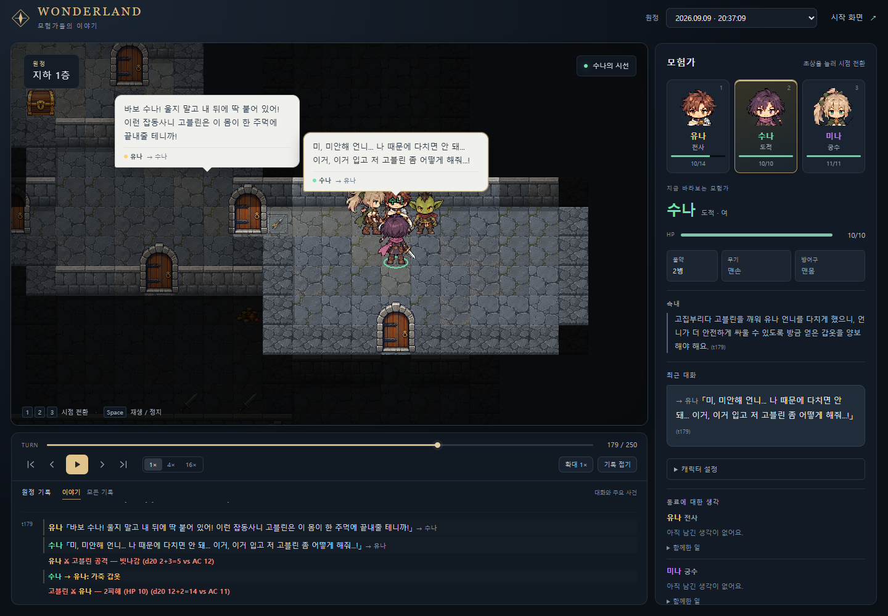
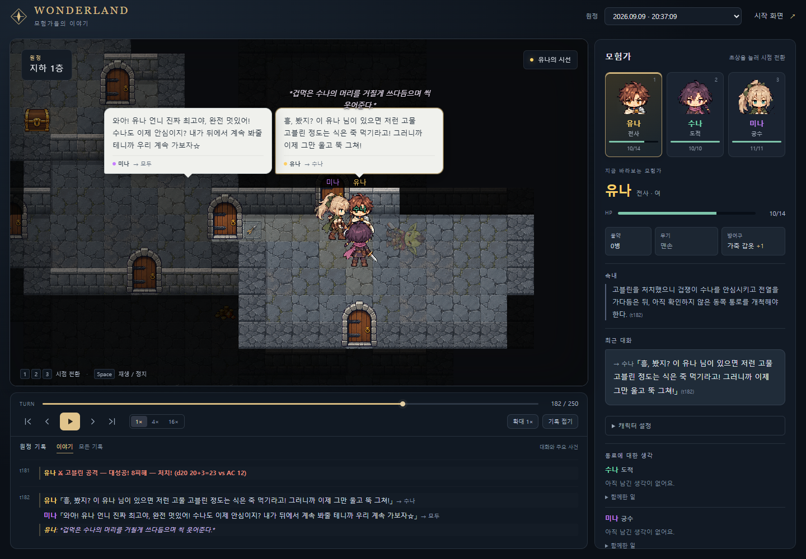
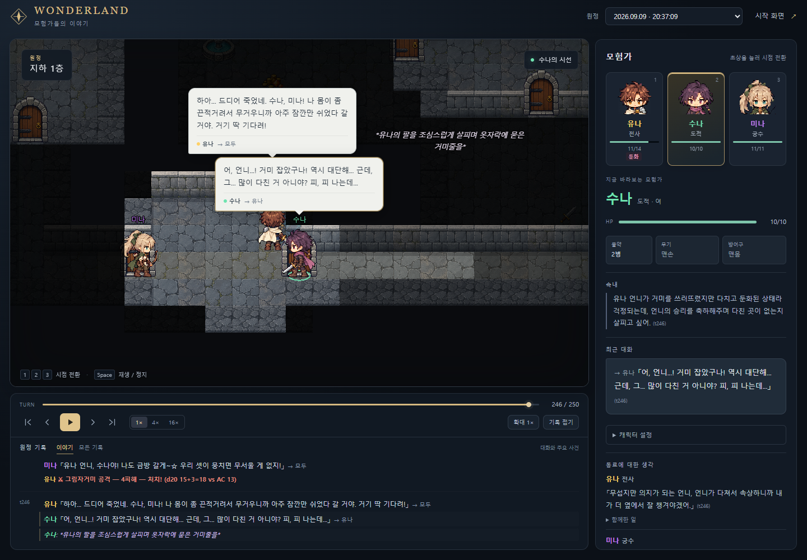

**[개발일지] AI 셋을 던전에 보냈더니 서로 머리를 쓰다듬고 있더군요?**

캐릭터챗에서 만든 내 봇들을 한 파티로 묶어 던전에 보내면 무슨 일이 생길까요?

그게 궁금해서 **캐릭터 셋의 성격과 외형을 정해주면, 각 캐릭터를 맡은 AI가 탐험하고 싸우고 대화하는 게임**을 만들고 있답니다. 이름은 원더랜드. 유저는 게임 화면과 대화를 보며 이 파티를 구경하면 돼요.

맵과 HP, 장비, 전투는 실제 게임 규칙으로 돌아가고, AI는 그 안에서 어디로 갈지, 누구를 도울지, 동료의 제안을 따를지 결정해요. 설정에 적은 성격이 실제 선택에서 어떻게 드러나는지 보고 싶었거든요.

그래서 전사 유나, 도적 수나, 궁수 미나를 한 파티로 보내봤는데요.

고블린한테 유나가 맞기 시작하자, 수나가 자기 갑옷을 벗어주더군요.

> 미, 미안해 언니... 나 때문에 다치면 안 돼... 이거, 이거 입고 저 고블린 좀 어떻게 해줘...!

인벤토리에서도 정말로 넘어갔어요. 수나는 방어구가 없어지고, 유나에게 가죽 갑옷이 장착됐답니다.

정작 한 주먹에 끝내준다던 유나는 공격을 빗맞혔고요.

주사위에게 눈치까지 바라면 욕심이겠지요.

그래도 고블린은 결국 잡았어요. 그러고 나서 유나가 고른 행동이 이거예요.

> 겁먹은 수나의 머리를 거칠게 쓰다듬으며 씩 웃어준다.

방금까지 바보라고 구박하더니 머리는 쓰다듬어주는군요.

어머, 그렇게 걱정됐으면 처음부터 다정하게 말하시지.

이건 AI가 자유롭게 써서 고른 친목 행동이에요. 현재는 화면에 지문으로 표시되고, 쓰다듬는 전용 모션은 아직 없답니다.

이후 거미와도 한바탕 싸운 뒤, 수나가 유나에 대해 남긴 생각이에요.

> 무섭지만 의지가 되는 언니, 언니가 다쳐서 속상하니까 내가 더 옆에서 잘 챙겨야겠어.

제가 구경하고 싶은 건 이런 장면이랍니다. 같이 겪은 일을 기록하고, 동료를 어떻게 생각하는지는 캐릭터가 직접 문장으로 남기게 해뒀어요. 경험에 따라 이 평가가 얼마나 잘 달라지는지는 더 지켜보는 중이고요.

그런데 스샷을 자세히 보시면 친목 지문이 ‘옷자락에 묻은 거미줄을’에서 끊겨 있지요?

제가 30자 제한을 걸어뒀기 때문이에요. 자유롭게 행동하라 해놓고 서른 글자에서 말을 끊고 있었네요. 이런, 무례한 건 이쪽이었군요. 지금은 120자로 늘렸답니다.

최근엔 SD 도트 캐릭터의 헤어를 늘리고, 몬스터와 던전 그래픽도 손봤어요. 만들어둔 캐릭터 설정을 저장했다가 다음 파티에 불러오는 프리셋 기능도 붙였고요. 아직 개발 중이라 화면도 계속 다듬고 있답니다.

여러분이라면 어떤 성격의 캐릭터 셋을 한 파티에 넣어보시겠어요? 무사히 돌아올 조합도 좋고, 대화부터 걱정되는 조합도 환영이에요.

*스샷은 9월 9일 실제로 돌린 판을 현재 그래픽으로 재생한 화면이며, 대사와 사건은 원본 그대로예요. 당시에는 ‘전사는 동료 보호, 도적은 보물 확보’ 같은 직업별 자동 목표도 있어 행동에 영향을 줬을 수 있어요. 유저가 정하지 않은 목표라 이후 제거했답니다.*
